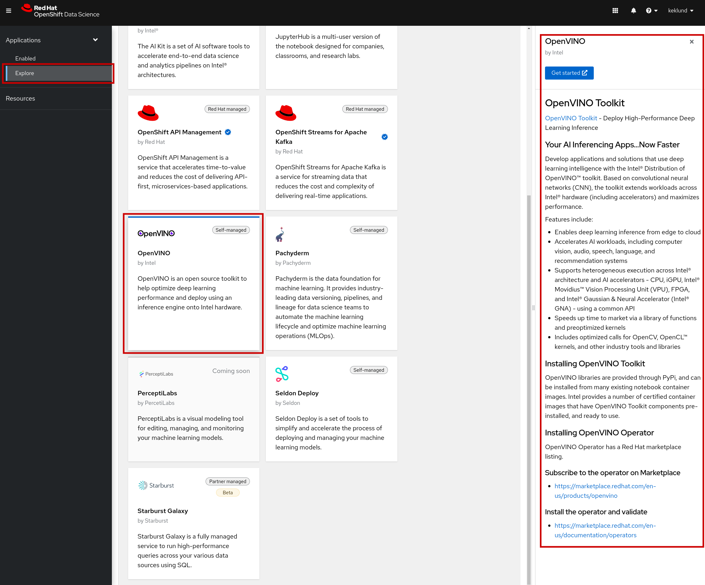
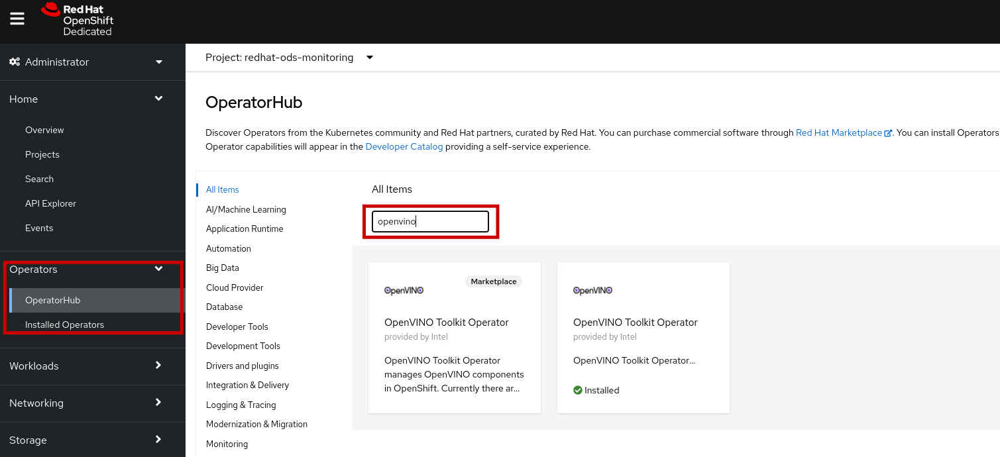

# Install Intel OpenVINO to Red Hat OpenShift Data Science 

Please continue onto [tutorial examples](02_examples.md) if OpenVINO is already enabled in Red Hat OpenShift Data Science.

**Install OpenVINO one of two ways:**
* [From the Red Hat OpenShift Data Science Dashboard - (preferred)](#install-using-red-hat-openshift-data-science-dashboard)
* [OperatorHub](#install-using-operatorhub-from-the-openshift-dedicated-dashboard)
<!-- or you are using the sandbox cluster (future) -->

## Install using Red Hat OpenShift Data Science Dashboard

Installing integrated partner software is extremely easy within the Red Hat OpenShift Data Science dashboard. 

Simply navigate to the "Explore" tab on the left and research components you'd like to add to your environment. 

Clicking the OpenVINO tile will open a panel on the right side of your screen so you can learn more about OpenVINO's benefits. 
There's a section called "Installing OpenVINO Toolkit".
Follow the links to subscribe and install using Red Hat Marketplace. 

Above is the current product listing in Red Hat Marketplace. 
The self-guided installation process only takes a few minutes after selecting "Purchase" or "Free trial". 

<!-- get some docs to link out to this piece --> 

## Install using OperatorHub from the OpenShift Dedicated Dashboard

This option is available to `cluster-admin`s within the OpenShift Dedicated environment.

Search for "OpenVINO" after navigating to OperatorHub underneath the Operators tab on the left-hand side of your screen. 

You still have the option to install using Red Hat Marketplace, or you can install the second tab directly. 
The same operator is installed either way. 
A panel will open on the right side of your screen.
Click install and follow instructions to install to your cluster.

## Installation complete. Let's get started! 

Now that you have Intel OpenVINO installed, navigate back to the "Enabled" tab within Red Hat OpenShift Data Science. 
You will see an OpenVINO tile displayed alongside your other components.

Intel OpenVINO offers an embedded notebook experience. 
We access their software through Jupyter Notebooks.
To get started, please click "Launch application" on the JupyterHub tile.

Next steps: [try some OpenVINO examples](02_examples.md)

## Navigation 

* [Welcome - Intel OpenVINO Tutorials Red Hat OpenShift Data Science](00_index.md)
* [Install OpenVINO to Red Hat OpenShift Data Science](01_install.md) - **(you are here)**
* [OpenVINO Examples](02_examples.md)
