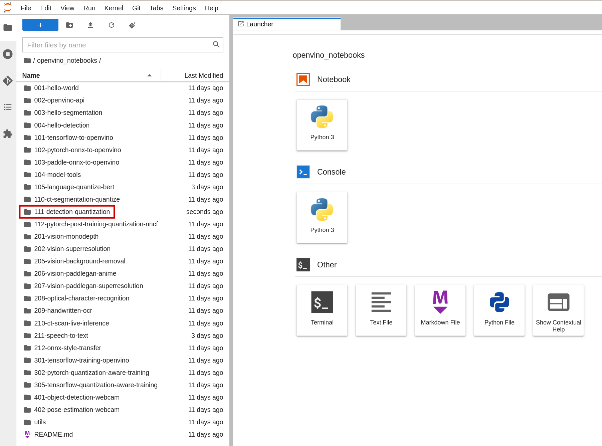

# Intel OpenVINO Tutorials 

The OpenVINO team provides tutorials to get you started with OpenVINO on Red Hat OpenShift Data Science directly within the container. 

Simply select "openvino_notebooks" from the file explorer on the left. 

There are 25-30 examples to choose from! 
For now, let's focus on the following three examples: 
* Person Detection 
* Speech to Text 
* Optical Character Recognition (OCR)

Follow the instructions below to run each OpenVINO example with Red Hat OpenShift Data Science.
Additionally, we provide links (below) to Intel's detailed documentation for example example. 

## Examples 

### Person Detection 

Select the "111-detection-quantization" folder after "openvino_notebooks" and open the "111-detection-quantization.ipynb" notebook. 
The tutorial will prepare your environment, download the model, quantize it, and compare the model to the quantized version.

*Click [here](https://docs.openvino.ai/latest/notebooks/111-detection-quantization-with-output.html) for Intel's documentation*

### Speech to Text 

Select the "211-speech-to-text" folder after "openvino_notebooks" and open the "211-speech-to-text.ipynb" notebook. 
The tutorial will prepare your environment, download the model, quantize it, and compare the model to the quantized version.

*Click [here](https://docs.openvino.ai/latest/notebooks/211-speech-to-text-with-output.html) for Intel's documentation*

### Optical Character Recognition (OCR) 

Select the "208-optical-character-recognition" folder after "openvino_notebooks" and open the "208-optical-character-recognition.ipynb" notebook. 
The tutorial will prepare your environment, download the model, quantize it, and compare the model to the quantized version.

*Click [here](https://docs.openvino.ai/latest/notebooks/208-optical-character-recognition-with-output.html) for Intel's documentation*
## Navigation 

* [Welcome - Intel OpenVINO Tutorials Red Hat OpenShift Data Science](00_index.md)
* [Install OpenVINO to Red Hat OpenShift Data Science](01_install.md) 
* [OpenVINO Examples](02_examples.md) - **(you are here)**
